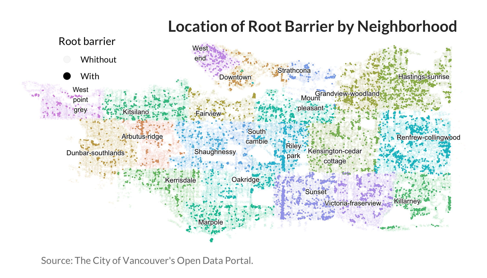

Mini Data Analysis Milestone 2
================

*To complete this milestone, you can either edit [this `.rmd`
file](https://raw.githubusercontent.com/UBC-STAT/stat545.stat.ubc.ca/master/content/mini-project/mini-project-2.Rmd)
directly. Fill in the sections that are commented out with
`<!--- start your work here--->`. When you are done, make sure to knit
to an `.md` file by changing the output in the YAML header to
`github_document`, before submitting a tagged release on canvas.*

# Welcome to the rest of your mini data analysis project!

In Milestone 1, you explored your data. and came up with research
questions. This time, we will finish up our mini data analysis and
obtain results for your data by:

- Making summary tables and graphs
- Manipulating special data types in R: factors and/or dates and times.
- Fitting a model object to your data, and extract a result.
- Reading and writing data as separate files.

We will also explore more in depth the concept of *tidy data.*

**NOTE**: The main purpose of the mini data analysis is to integrate
what you learn in class in an analysis. Although each milestone provides
a framework for you to conduct your analysis, it’s possible that you
might find the instructions too rigid for your data set. If this is the
case, you may deviate from the instructions – just make sure you’re
demonstrating a wide range of tools and techniques taught in this class.

# Instructions

**To complete this milestone**, edit [this very `.Rmd`
file](https://raw.githubusercontent.com/UBC-STAT/stat545.stat.ubc.ca/master/content/mini-project/mini-project-2.Rmd)
directly. Fill in the sections that are tagged with
`<!--- start your work here--->`.

**To submit this milestone**, make sure to knit this `.Rmd` file to an
`.md` file by changing the YAML output settings from
`output: html_document` to `output: github_document`. Commit and push
all of your work to your mini-analysis GitHub repository, and tag a
release on GitHub. Then, submit a link to your tagged release on canvas.

**Points**: This milestone is worth 50 points: 45 for your analysis, and
5 for overall reproducibility, cleanliness, and coherence of the Github
submission.

**Research Questions**: In Milestone 1, you chose two research questions
to focus on. Wherever realistic, your work in this milestone should
relate to these research questions whenever we ask for justification
behind your work. In the case that some tasks in this milestone don’t
align well with one of your research questions, feel free to discuss
your results in the context of a different research question.

# Learning Objectives

By the end of this milestone, you should:

- Understand what *tidy* data is, and how to create it using `tidyr`.
- Generate a reproducible and clear report using R Markdown.
- Manipulating special data types in R: factors and/or dates and times.
- Fitting a model object to your data, and extract a result.
- Reading and writing data as separate files.

# Setup

Begin by loading your data, packages, and saving your own functions:

``` r
# Packages
library(datateachr) # <- might contain the data you picked!
library(tidyverse)
library(scales)
library(ggdist)
library(ggridges)
library(ggrepel)
library(here)

# Own functions
mi_tema <- function (...) {
  ggplot2::theme_minimal() + 
    ggplot2::theme(text = ggplot2::element_text(family = "Lato"), 
                   axis.line = ggplot2::element_line(linewidth = 0.3), 
                   plot.title = ggplot2::element_text(hjust = 0.5,
                                                      size = 14,
                                                      face = "bold", 
                                                      color = "grey20"), 
                   plot.title.position = "plot", 
                   plot.subtitle = ggplot2::element_text(hjust = 0.5,
                                                         size = 12,
                                                         color = "gray50"), 
                   plot.caption = ggplot2::element_text(color = "gray50",
                                                        size = 10, 
                                                        hjust = 0),
                   panel.grid = ggplot2::element_line(linetype = 2, 
                                                      linewidth = 0.3,
                                                      color = "gray90"), 
                   panel.grid.minor = ggplot2::element_blank(), 
                   legend.key.width = unit(0.7, "cm"), 
                   legend.margin = margin(0, 0, 0, 0), 
                   legend.spacing = unit(0, "cm"),
                   strip.background = ggplot2::element_rect(fill = "gray95", 
                                                            linetype = "blank"), 
                   panel.border = ggplot2::element_rect(color = "gray95", 
                                                        fill = NA),
                   rect = ggplot2::element_rect(fill = "transparent")) + 
    ggplot2::theme(...)
}

mi_tema2 <- function (...) 
{
  ggplot2::theme_void() + 
    ggplot2::theme(legend.position = "top", 
                   panel.background = ggplot2::element_rect(fill = "transparent", 
                                                            color = "transparent"),
                   plot.title.position = "plot", 
                   text = ggplot2::element_text(family = "Lato"), 
                   plot.title = ggplot2::element_text(hjust = 0.85, 
                                                      vjust = 0, 
                                                      size = 16,
                                                      face = "bold", 
                                                      color = "grey20"), 
                   plot.subtitle = ggplot2::element_text(hjust = 0.5, size = 12, 
                                                         color = "gray50"),
                   plot.caption = ggplot2::element_text(color = "gray50", 
                                                        size = 10,
                                                        hjust = 0.15), 
                   plot.margin = unit(c(0, 0, 0, 0), "null"), 
                   panel.border = ggplot2::element_blank(), 
                   legend.margin = ggplot2::margin(0, 0, 0, 0), 
                   legend.spacing = unit(0, "cm"), 
                   panel.spacing = unit(c(0, 0, 0, 0), "null")) + 
    ggplot2::theme(...)
}
```

# Task 1: Process and summarize your data

From milestone 1, you should have an idea of the basic structure of your
dataset (e.g. number of rows and columns, class types, etc.). Here, we
will start investigating your data more in-depth using various data
manipulation functions.

### 1.1 (1 point)

First, write out the 4 research questions you defined in milestone 1
were. This will guide your work through milestone 2:

<!-------------------------- Start your work below ---------------------------->

1.  What is the most common species of tree in each neighborhood?

2.  What is the range of tree heights and how are diameters distributed
    across neighborhoods?

3.  How many trees have root barriers installed, and what is the
    distribution between neighborhoods?

4.  How many trees were planted in each decade, and how does this vary
    across neighborhoods?

<!----------------------------------------------------------------------------->

Here, we will investigate your data using various data manipulation and
graphing functions.

### 1.2 (8 points)

Now, for each of your four research questions, choose one task from
options 1-4 (summarizing), and one other task from 4-8 (graphing). You
should have 2 tasks done for each research question (8 total). Make sure
it makes sense to do them! (e.g. don’t use a numerical variables for a
task that needs a categorical variable.). Comment on why each task helps
(or doesn’t!) answer the corresponding research question.

Ensure that the output of each operation is printed!

Also make sure that you’re using dplyr and ggplot2 rather than base R.
Outside of this project, you may find that you prefer using base R
functions for certain tasks, and that’s just fine! But part of this
project is for you to practice the tools we learned in class, which is
dplyr and ggplot2.

**Summarizing:**

1.  Compute the *range*, *mean*, and *two other summary statistics* of
    **one numerical variable** across the groups of **one categorical
    variable** from your data.
2.  Compute the number of observations for at least one of your
    categorical variables. Do not use the function `table()`!
3.  Create a categorical variable with 3 or more groups from an existing
    numerical variable. You can use this new variable in the other
    tasks! *An example: age in years into “child, teen, adult, senior”.*
4.  Compute the proportion and counts in each category of one
    categorical variable across the groups of another categorical
    variable from your data. Do not use the function `table()`!

**Graphing:**

6.  Create a graph of your choosing, make one of the axes logarithmic,
    and format the axes labels so that they are “pretty” or easier to
    read.
7.  Make a graph where it makes sense to customize the alpha
    transparency.

Using variables and/or tables you made in one of the “Summarizing”
tasks:

8.  Create a graph that has at least two geom layers.
9.  Create 3 histograms, with each histogram having different sized
    bins. Pick the “best” one and explain why it is the best.

Make sure it’s clear what research question you are doing each operation
for!

<!------------------------- Start your work below ----------------------------->

### Initial recodification

This code adjusts some variables that will be repeatedly utilized in the
upcoming tasks.

``` r
vancouver_trees <- vancouver_trees %>% 
  mutate(across(c(neighbourhood_name, 
                  species_name),
                str_to_sentence)) # Recode neighbourhood_name and species_name
```

## 1. What is the most common species of tree in each neighbourhood?

### Summarizing: Compute the number of observations for at least one of your categorical variables.

This code counts the occurrences of each combination of neighbourhood
and tree species, essentially finding out **how many trees of each
species are in each neighbourhood**. Then, it identifies the most common
species in each neighbourhood based on the count. This task is directly
relevant and contributes significantly to answering the research
question.

``` r
main_species <- vancouver_trees %>% 
  count(neighbourhood_name, species_name, sort = T) 

# Here, I display the two most common species in each neighbourhood
main_species %>% 
  slice_max(n, n = 2, 
            by = neighbourhood_name)
```

    ## # A tibble: 44 × 3
    ##    neighbourhood_name  species_name     n
    ##    <chr>               <chr>        <int>
    ##  1 Victoria-fraserview Cerasifera    1241
    ##  2 Victoria-fraserview Serrulata      840
    ##  3 Kitsilano           Platanoides   1188
    ##  4 Kitsilano           Serrulata      559
    ##  5 Dunbar-southlands   Platanoides   1165
    ##  6 Dunbar-southlands   Cerasifera    1061
    ##  7 Shaughnessy         Platanoides   1139
    ##  8 Shaughnessy         Americana      780
    ##  9 Kerrisdale          Platanoides   1067
    ## 10 Kerrisdale          Serrulata      716
    ## # ℹ 34 more rows

### Graphing: Create a graph that has at least two geom layers.

This code creates a bar plot to display the two most common tree species
in each neighbourhood and the rest in the category “Others.” Then, it
adds a layer with the proportion of each category. This visualization
helps to see the most common tree species in each neighbourhood and
answer the research question.

``` r
main_species %>% 
  mutate(species_name = ifelse(rank(-n) < 3, 
                               str_to_sentence(species_name), 
                               "Others"), # Recode species to keep the two most common tree species in each neighbourhood 
         prop = n /  sum(n), # Species as proportion of trees in the neighbourhood
         .by = neighbourhood_name) %>% 
  summarise(n = sum(n), # Summarize by neighbourhood to o unified recoded categories
            prop = sum(prop),
            .by = c(neighbourhood_name, species_name)) %>% 
  ggplot(aes(x = reorder(neighbourhood_name, 
                         ifelse(species_name == "Others",
                                prop, 0)), # Reorder bars based on the percentage of "Others"
             y = prop,
             fill = reorder(species_name, prop))) +
  coord_flip() +
  geom_col() +
  geom_text(aes(label = percent(prop,
                                accuracy = 1L)),
            position = position_stack(0.5),
            size = 3.5) +
  labs(title = "Proportion of trees in each neighborhood",
       fill = "Species",
       x = element_blank(),
       y = "Number of trees",
       caption = "Source: The City of Vancouver's Open Data Portal.") +
  scale_y_continuous(labels = percent,
                     expand = expansion(mult = c(0.01, 0.02))) +
  scale_fill_brewer(palette = "Set2") +
  mi_tema(legend.position = "top",
          legend.justification = c(0, 0),
          legend.key.height = unit(0.4, "cm"))
```


## 2. How are tree diameters distributed across neighbourhoods?

### Summarizing: Compute the *range*, *mean*, and *two other summary statistics* of **one numerical variable** across the groups of **one categorical variable** from your data.

The code below summarizes the variable ‘diameter’ statistics within
different neighbourhoods. It estimates various statistics including
range, mean, median, and percentiles. The code effectively answers the
research question by providing quantitative measures that describe the
distribution of diameters across neighbourhoods.

``` r
dmtr_statistics <- vancouver_trees %>% 
  group_by(neighbourhood_name) %>% 
  summarise(dmtr_rng_txt = paste0(range(diameter),
                                  collapse = ", "), # Estimating range and concatenating lower and upper bound
            dmtr_mean = mean(diameter), 
            dmtr_median = median(diameter),
            dmtr_low_int_99 = quantile(diameter, .005), # low_int variables compute the lower bound of the x% interval range
            dmtr_low_int_95 = quantile(diameter, .025),
            dmtr_low_int_50 = quantile(diameter, .25),
            dmtr_upp_int_50 = quantile(diameter, .75), # low_int variables compute the upper bound of the x% interval range
            dmtr_upp_int_95 = quantile(diameter, .975),
            dmtr_upp_int_99 = quantile(diameter, .995))

dmtr_statistics
```

    ## # A tibble: 22 × 10
    ##    neighbourhood_name       dmtr_rng_txt dmtr_mean dmtr_median dmtr_low_int_99
    ##    <chr>                    <chr>            <dbl>       <dbl>           <dbl>
    ##  1 Arbutus-ridge            0, 62            11.9         10              2   
    ##  2 Downtown                 1, 151            7.45         6              3   
    ##  3 Dunbar-southlands        0, 305           13.9         12              2   
    ##  4 Fairview                 1.25, 99         10.6          9              2.50
    ##  5 Grandview-woodland       0, 63            11.4          8.5            2   
    ##  6 Hastings-sunrise         0, 435           11.0          8.5            3   
    ##  7 Kensington-cedar cottage 0, 99            11.7          9.5            2   
    ##  8 Kerrisdale               0, 156           12.7         10              2   
    ##  9 Killarney                0, 50            10.1          8              2   
    ## 10 Kitsilano                0, 317           14.4         12              2   
    ## # ℹ 12 more rows
    ## # ℹ 5 more variables: dmtr_low_int_95 <dbl>, dmtr_low_int_50 <dbl>,
    ## #   dmtr_upp_int_50 <dbl>, dmtr_upp_int_95 <dbl>, dmtr_upp_int_99 <dbl>

### Graphing: Create a graph that has at least two geom layers.

The code shown below uses the previously generated statistics to create
a graph that visualizes the distribution of tree diameters in each
neighbourhood. Using different visual elements (such as points and
intervals) allows for communicating various spread and median measures.

``` r
dmtr_statistics %>% 
  pivot_longer(c(contains("int_")),
               names_to = c(".value", ".width"),
               names_sep = "_int_") %>% 
  # mutate(.width = as.numeric(.width)) %>% 
  group_by(neighbourhood_name) %>%
  ggplot(aes(x = reorder(neighbourhood_name, dmtr_median), 
             y = dmtr_mean,
             ymin = dmtr_low,
             ymax = dmtr_upp)) + 
  coord_flip() +
  geom_interval() +
  geom_point(aes(y = dmtr_median,
                 fill = "Median"),
             color = "transparent",
             shape = 21) +  
  labs(title = "Distribution of Tree Diameters by Neighborhood",
       x = element_blank(),
       y = "Diameter (inches)",
       fill = "",
       color = "Interval range",
       caption = "Source: The City of Vancouver's Open Data Portal.") +
  scale_color_manual(values = c("#00b3c4",
                                "#2A9D8F",
                                "#006D77"),
                     labels = c("99%", "95%", "50%")) +
  scale_fill_manual(values = "#A4243B") +
  mi_tema(legend.position = "top") 
```


## 3. How many trees have root barriers installed, and what is the distribution between neighbourhoods?

### Summarizing: Compute the number of observations for at least one of your categorical variables.

The code below generates the count of trees with and without root
barriers in each neighbourhood. The resulting table allows a clear
comparison of the distribution of trees with this characteristic across
different neighbourhoods, which answers the research question.

``` r
root_b_count <- vancouver_trees %>% 
  count(root_barrier,
        .by = neighbourhood_name)

root_b_count
```

    ## # A tibble: 44 × 3
    ##    root_barrier .by                          n
    ##    <chr>        <chr>                    <int>
    ##  1 N            Arbutus-ridge             4968
    ##  2 N            Downtown                  4833
    ##  3 N            Dunbar-southlands         9208
    ##  4 N            Fairview                  3754
    ##  5 N            Grandview-woodland        6169
    ##  6 N            Hastings-sunrise          9492
    ##  7 N            Kensington-cedar cottage 10445
    ##  8 N            Kerrisdale                6684
    ##  9 N            Killarney                 5653
    ## 10 N            Kitsilano                 7673
    ## # ℹ 34 more rows

### Graphing: Make a graph where it makes sense to customize the alpha transparency.

The code below maps the location of trees. It utilizes alpha
transparency to differentiate between trees with and without root
barriers and colour aesthetics to represent different neighbourhoods.

Using transparency in this context is beneficial as it enables us to
differentiate between trees with and without root barriers, while colour
coding helps identify the neighbourhoods. However, it is worth noting
that there may be better approaches. Determining the exact number of
trees with root barriers may be challenging and the presence of these
barriers could be confused with high tree concentrations.

``` r
vancouver_trees %>% 
  ggplot(aes(x = longitude,
                 y = latitude)) +
  coord_sf() +
  geom_jitter(aes(alpha = root_barrier,
                 color = neighbourhood_name),
             size = 0.05,
             stroke = 0.5,
             width = 0.0005,
             height = 0.0005) +
  geom_text_repel(data = . %>% 
                    summarise(longitude = mean(longitude, na.rm = T),
                              latitude = mean(latitude, na.rm = T),
                              .by = neighbourhood_name),
                  aes(label = str_wrap(neighbourhood_name,
                                       5)),
                  force = 4,
                  force_pull = 50,
                  bg.color = "grey98", # shadow color
                  bg.r = 0.1,
                  size = 2.5) +
  scale_colour_hue(h = c(40, 300),
                   c = 60,
                   l = 70,
                   h.start = 1,
                   guide = "none") +
    labs(title = "Location of Root Barrier by Neighborhood",
       alpha = "Root barrier",
       caption = "Source: The City of Vancouver's Open Data Portal.") +
  scale_alpha_discrete(range = c(0.03, 1),
                       labels = c("Whithout", "With")) +
  guides(alpha = guide_legend(override.aes = list(size = 3))) +
  mi_tema2(legend.position = c(0.18, 0.87)) 
```



## 4. How many trees were planted in each decade, and how does this vary across neighborhoods?

### Summarizing: Create a categorical variable with 3 or more groups from an existing numerical variable.

The code below extracts the year (a numerical variable) from the
`date_planted` variable and then categorizes it into decades (e.g.,
‘1980s’, ‘1990s’). It then counts by neighbourhood and decade. The
resulting counts provide valuable insights into the number of trees
planted each decade and how this varies across neighbourhoods.

``` r
vancouver_trees <- vancouver_trees %>% 
  mutate(year = year(date_planted), # Creating numerical variable
         decade = if_else(!is.na(year), # Creating decades category
                          paste0(round(year, -1), "'s"),
                          NA))

# Count of trees planted for decade in each neighbourhood
vancouver_trees %>% 
  count(neighbourhood_name, 
        decade)
```

    ## # A tibble: 110 × 3
    ##    neighbourhood_name decade     n
    ##    <chr>              <chr>  <int>
    ##  1 Arbutus-ridge      1990's   290
    ##  2 Arbutus-ridge      2000's  1397
    ##  3 Arbutus-ridge      2010's   742
    ##  4 Arbutus-ridge      2020's   225
    ##  5 Arbutus-ridge      <NA>    2515
    ##  6 Downtown           1990's   151
    ##  7 Downtown           2000's   920
    ##  8 Downtown           2010's  1014
    ##  9 Downtown           2020's   165
    ## 10 Downtown           <NA>    2909
    ## # ℹ 100 more rows

### Graphing: Create 3 histograms, with each histogram having different sized bins. Pick the “best” one and explain why it is the best.

The code below generates three histograms with different bin sizes (30,
50, and 70) to visualize the distribution of tree plantings over time.
Among the three histograms, the one with ‘bins = 50’ is likely the best
choice —a bin size of 50 balances capturing the underlying distribution
and avoiding excessive detail or noise.

This plot addresses the research question by showing the number of trees
planted over time. However, it is noted that a histogram may not be the
best plot to present results over time.

``` r
# Base plot
base_plot <- vancouver_trees %>% 
  ggplot(aes(x = date_planted,
             y = neighbourhood_name)) +
  mi_tema(legend.position = "top") +
  labs(title = "Date of planting by Neighborhood",
       x = "Date of planting",
       y = element_blank(),
       fill = "",
       color = "Interval range",
       caption = "Source: The City of Vancouver's Open Data Portal.") 

# Histogram with bins = 30
base_plot +
  geom_density_ridges(stat = "binline", 
                      bins = 30, 
                      scale = 2.5,
                      alpha = 0.5,
                      size = 0.2,
                      fill = "#006D77") +
    labs(subtitle = "bins = 30")
```


``` r
# Histogram with bins = 50
base_plot +
  geom_density_ridges(stat = "binline", 
                      bins = 50, 
                      scale = 2.5,
                      alpha = 0.5,
                      size = 0.2,
                      fill = "#006D77") +
    labs(subtitle = "bins = 50")
```


``` r
# Histogram with bins = 70
base_plot +
  geom_density_ridges(stat = "binline", 
                      bins = 70, 
                      scale = 2.5,
                      alpha = 0.5,
                      size = 0.2,
                      fill = "#006D77") +
    labs(subtitle = "bins = 70")
```


<!----------------------------------------------------------------------------->

### 1.3 (2 points)

Based on the operations that you’ve completed, how much closer are you
to answering your research questions? Think about what aspects of your
research questions remain unclear. Can your research questions be
refined, now that you’ve investigated your data a bit more? Which
research questions are yielding interesting results?

<!------------------------- Write your answer here ---------------------------->

In the previous sections of this analysis, we have made progress toward
understanding the primary characteristics of street trees in each
neighbourhood. We have explored various aspects such as tree most common
species, planting dates, diameters and root barriers, which However, it
seems to be a small portion . For instance, we may need to investigate
further factors and environmental conditions that contribute to the
overall characteristics of the urban tree ecosystem.

To refine the research question, we could consider specifying certain
characteristics (e.g., tree diversity, age distribution) or focusing on
specific neighbourhoods for a more in-depth analysis.

The research questions related to tree species distribution, planting
dates, and the presence of root barriers are yielding interesting
results. These factors provide valuable insights into the composition
and management of the urban tree ecosystem in each neighbourhood.
Further exploring these aspects may lead to a more comprehensive
understanding of the overall characteristics.
<!----------------------------------------------------------------------------->

# Task 2: Tidy your data

In this task, we will do several exercises to reshape our data. The goal
here is to understand how to do this reshaping with the `tidyr` package.

A reminder of the definition of *tidy* data:

- Each row is an **observation**
- Each column is a **variable**
- Each cell is a **value**

### 2.1 (2 points)

Based on the definition above, can you identify if your data is tidy or
untidy? Go through all your columns, or if you have \>8 variables, just
pick 8, and explain whether the data is untidy or tidy.

<!--------------------------- Start your work below --------------------------->

I think that the `vancouver_trees` data set has a tidy structure. Each
row corresponds to a different tree, and each column represents a
specific attribute of that tree. For instance, `tree_id` serves as a
unique identifier for each tree; `civic_number`, `std_street`,
`on_street`, `street_side_name`, `neighbourhood_name`, `longitude`, and
`latitude` provide location details for each tree; the columns
`genus_name`, `species_name`, `cultivar_name`, and `common_name` offer
information about the tree’s natural classification; and
`height_range_id`, `diameter`, `curb`, `date_planted`, and `curb`
provide details about specific characteristics of each street tree.
Importantly, every value is assigned to a specific cell.
<!----------------------------------------------------------------------------->

### 2.2 (4 points)

Now, if your data is tidy, untidy it! Then, tidy it back to it’s
original state.

If your data is untidy, then tidy it! Then, untidy it back to it’s
original state.

Be sure to explain your reasoning for this task. Show us the “before”
and “after”.

<!--------------------------- Start your work below --------------------------->

As I mentioned earlier, the `vancouver_trees` dataset is tidy.
Consequently, this process is split into two parts. The first part
involves transforming the dataset into a untidy and the second part is
about reverting it back to its original form.

In the first section, the idea is to create a dataset with a pseudo JSON
format embedded within a dataframe. This means that each tree will be
represented as a cell, and within that cell, there will be a dataframe.
The first column of this dataframe will hold the attribute name, and the
second column will contain its corresponding value.”

``` r
untidy_trees <- vancouver_trees %>% 
  mutate(row = row_number(),
         across(tree_id:decade, as.character)) %>%  
  pivot_longer(tree_id:decade) %>% 
  nest_by(row)
  
# Now, the data set has two columns: `row` and data
head(untidy_trees)
```

    ## # A tibble: 6 × 2
    ## # Rowwise:  row
    ##     row               data
    ##   <int> <list<tibble[,2]>>
    ## 1     1           [22 × 2]
    ## 2     2           [22 × 2]
    ## 3     3           [22 × 2]
    ## 4     4           [22 × 2]
    ## 5     5           [22 × 2]
    ## 6     6           [22 × 2]

``` r
# Inside the data cell we can find a data frame where the first column is the name of the column and the second its value.
head(untidy_trees$data[[1]])
```

    ## # A tibble: 6 × 2
    ##   name          value    
    ##   <chr>         <chr>    
    ## 1 tree_id       149556   
    ## 2 civic_number  494      
    ## 3 std_street    W 58TH AV
    ## 4 genus_name    ULMUS    
    ## 5 species_name  Americana
    ## 6 cultivar_name BRANDON

Now, we will rever this process.

``` r
tidy_trees <- untidy_trees %>% 
  unnest(data) %>% 
  pivot_wider(names_from = name,
              values_from = value) %>% 
  ungroup() %>% 
    select(-row)
  
# Now, it has returned to its original form
head(tidy_trees)
```

    ## # A tibble: 6 × 22
    ##   tree_id civic_number std_street genus_name species_name cultivar_name  
    ##   <chr>   <chr>        <chr>      <chr>      <chr>        <chr>          
    ## 1 149556  494          W 58TH AV  ULMUS      Americana    BRANDON        
    ## 2 149563  450          W 58TH AV  ZELKOVA    Serrata      <NA>           
    ## 3 149579  4994         WINDSOR ST STYRAX     Japonica     <NA>           
    ## 4 149590  858          E 39TH AV  FRAXINUS   Americana    AUTUMN APPLAUSE
    ## 5 149604  5032         WINDSOR ST ACER       Campestre    <NA>           
    ## 6 149616  585          W 61ST AV  PYRUS      Calleryana   CHANTICLEER    
    ## # ℹ 16 more variables: common_name <chr>, assigned <chr>, root_barrier <chr>,
    ## #   plant_area <chr>, on_street_block <chr>, on_street <chr>,
    ## #   neighbourhood_name <chr>, street_side_name <chr>, height_range_id <chr>,
    ## #   diameter <chr>, curb <chr>, date_planted <chr>, longitude <chr>,
    ## #   latitude <chr>, year <chr>, decade <chr>

<!----------------------------------------------------------------------------->

### 2.3 (4 points)

Now, you should be more familiar with your data, and also have made
progress in answering your research questions. Based on your interest,
and your analyses, pick 2 of the 4 research questions to continue your
analysis in the remaining tasks:

<!-------------------------- Start your work below ---------------------------->

1.  *FILL_THIS_IN*
2.  *FILL_THIS_IN*

<!----------------------------------------------------------------------------->

Explain your decision for choosing the above two research questions.

<!--------------------------- Start your work below --------------------------->
<!----------------------------------------------------------------------------->

Now, try to choose a version of your data that you think will be
appropriate to answer these 2 questions. Use between 4 and 8 functions
that we’ve covered so far (i.e. by filtering, cleaning, tidy’ing,
dropping irrelevant columns, etc.).

(If it makes more sense, then you can make/pick two versions of your
data, one for each research question.)

<!--------------------------- Start your work below --------------------------->

# Task 3: Modelling

## 3.0 (no points)

Pick a research question from 1.2, and pick a variable of interest
(we’ll call it “Y”) that’s relevant to the research question. Indicate
these.

<!-------------------------- Start your work below ---------------------------->

**Research Question**: How are tree diameters distributed across
neighbourhoods?

**Variable of interest**: diameters

<!----------------------------------------------------------------------------->

## 3.1 (3 points)

Fit a model or run a hypothesis test that provides insight on this
variable with respect to the research question. Store the model object
as a variable, and print its output to screen. We’ll omit having to
justify your choice, because we don’t expect you to know about model
specifics in STAT 545.

- **Note**: It’s OK if you don’t know how these models/tests work. Here
  are some examples of things you can do here, but the sky’s the limit.

  - You could fit a model that makes predictions on Y using another
    variable, by using the `lm()` function.
  - You could test whether the mean of Y equals 0 using `t.test()`, or
    maybe the mean across two groups are different using `t.test()`, or
    maybe the mean across multiple groups are different using `anova()`
    (you may have to pivot your data for the latter two).
  - You could use `lm()` to test for significance of regression
    coefficients.

<!-------------------------- Start your work below ---------------------------->

``` r
vancouver_trees
```

    ## # A tibble: 146,611 × 22
    ##    tree_id civic_number std_street    genus_name species_name cultivar_name  
    ##      <dbl>        <dbl> <chr>         <chr>      <chr>        <chr>          
    ##  1  149556          494 W 58TH AV     ULMUS      Americana    BRANDON        
    ##  2  149563          450 W 58TH AV     ZELKOVA    Serrata      <NA>           
    ##  3  149579         4994 WINDSOR ST    STYRAX     Japonica     <NA>           
    ##  4  149590          858 E 39TH AV     FRAXINUS   Americana    AUTUMN APPLAUSE
    ##  5  149604         5032 WINDSOR ST    ACER       Campestre    <NA>           
    ##  6  149616          585 W 61ST AV     PYRUS      Calleryana   CHANTICLEER    
    ##  7  149617         4909 SHERBROOKE ST ACER       Platanoides  COLUMNARE      
    ##  8  149618         4925 SHERBROOKE ST ACER       Platanoides  COLUMNARE      
    ##  9  149619         4969 SHERBROOKE ST ACER       Platanoides  COLUMNARE      
    ## 10  149625          720 E 39TH AV     FRAXINUS   Americana    AUTUMN APPLAUSE
    ## # ℹ 146,601 more rows
    ## # ℹ 16 more variables: common_name <chr>, assigned <chr>, root_barrier <chr>,
    ## #   plant_area <chr>, on_street_block <dbl>, on_street <chr>,
    ## #   neighbourhood_name <chr>, street_side_name <chr>, height_range_id <dbl>,
    ## #   diameter <dbl>, curb <chr>, date_planted <date>, longitude <dbl>,
    ## #   latitude <dbl>, year <dbl>, decade <chr>

``` r
model <- lm(diameter ~ neighbourhood_name,
          data = vancouver_trees)

one_way <- aov(diameter ~ neighbourhood_name, data = vancouver_trees)


one_way <- aov(diameter ~ neighbourhood_name, data = vancouver_trees)

plot(one_way, 2)
```

<!-- -->

``` r
aov_residuals <- residuals(object = one_way)
# Run Shapiro-Wilk test
shapiro.test(x = sample(aov_residuals, 4000))
```

    ## 
    ##  Shapiro-Wilk normality test
    ## 
    ## data:  sample(aov_residuals, 4000)
    ## W = 0.62724, p-value < 2.2e-16

<!----------------------------------------------------------------------------->

## 3.2 (3 points)

Produce something relevant from your fitted model: either predictions on
Y, or a single value like a regression coefficient or a p-value.

- Be sure to indicate in writing what you chose to produce.
- Your code should either output a tibble (in which case you should
  indicate the column that contains the thing you’re looking for), or
  the thing you’re looking for itself.
- Obtain your results using the `broom` package if possible. If your
  model is not compatible with the broom function you’re needing, then
  you can obtain your results by some other means, but first indicate
  which broom function is not compatible.

<!-------------------------- Start your work below ---------------------------->
<!----------------------------------------------------------------------------->

# Task 4: Reading and writing data

Get set up for this exercise by making a folder called `output` in the
top level of your project folder / repository. You’ll be saving things
there.

## 4.1 (3 points)

Take a summary table that you made from Task 1, and write it as a csv
file in your `output` folder. Use the `here::here()` function.

- **Robustness criteria**: You should be able to move your Mini Project
  repository / project folder to some other location on your computer,
  or move this very Rmd file to another location within your project
  repository / folder, and your code should still work.
- **Reproducibility criteria**: You should be able to delete the csv
  file, and remake it simply by knitting this Rmd file.

<!-------------------------- Start your work below ---------------------------->

My repository does not contain an R project to indicate the rood of the
project. To address this, I’ve created a `.here` file that serves as a
reference point for the root of the repository, regardless of the
location of the Rmd file.

Now, we can utilize the `here()` function as outlined below.

``` r
dir.create(here("output"),
           showWarnings = F)

write_csv(root_b_count,
          here("output", "root_b_count.csv"))
```

<!----------------------------------------------------------------------------->

## 4.2 (3 points)

Write your model object from Task 3 to an R binary file (an RDS), and
load it again. Be sure to save the binary file in your `output` folder.
Use the functions `saveRDS()` and `readRDS()`.

- The same robustness and reproducibility criteria as in 4.1 apply here.

<!-------------------------- Start your work below ---------------------------->

``` r
saveRDS(model, file = here("output", "model.rds"))

my_data <- readRDS(here("output", "model.rds"))
```

<!----------------------------------------------------------------------------->

# Overall Reproducibility/Cleanliness/Coherence Checklist

Here are the criteria we’re looking for.

## Coherence (0.5 points)

The document should read sensibly from top to bottom, with no major
continuity errors.

The README file should still satisfy the criteria from the last
milestone, i.e. it has been updated to match the changes to the
repository made in this milestone.

## File and folder structure (1 points)

You should have at least three folders in the top level of your
repository: one for each milestone, and one output folder. If there are
any other folders, these are explained in the main README.

Each milestone document is contained in its respective folder, and
nowhere else.

Every level-1 folder (that is, the ones stored in the top level, like
“Milestone1” and “output”) has a `README` file, explaining in a sentence
or two what is in the folder, in plain language (it’s enough to say
something like “This folder contains the source for Milestone 1”).

## Output (1 point)

All output is recent and relevant:

- All Rmd files have been `knit`ted to their output md files.
- All knitted md files are viewable without errors on Github. Examples
  of errors: Missing plots, “Sorry about that, but we can’t show files
  that are this big right now” messages, error messages from broken R
  code
- All of these output files are up-to-date – that is, they haven’t
  fallen behind after the source (Rmd) files have been updated.
- There should be no relic output files. For example, if you were
  knitting an Rmd to html, but then changed the output to be only a
  markdown file, then the html file is a relic and should be deleted.

Our recommendation: delete all output files, and re-knit each
milestone’s Rmd file, so that everything is up to date and relevant.

## Tagged release (0.5 point)

You’ve tagged a release for Milestone 2.

### Attribution

Thanks to Victor Yuan for mostly putting this together.
